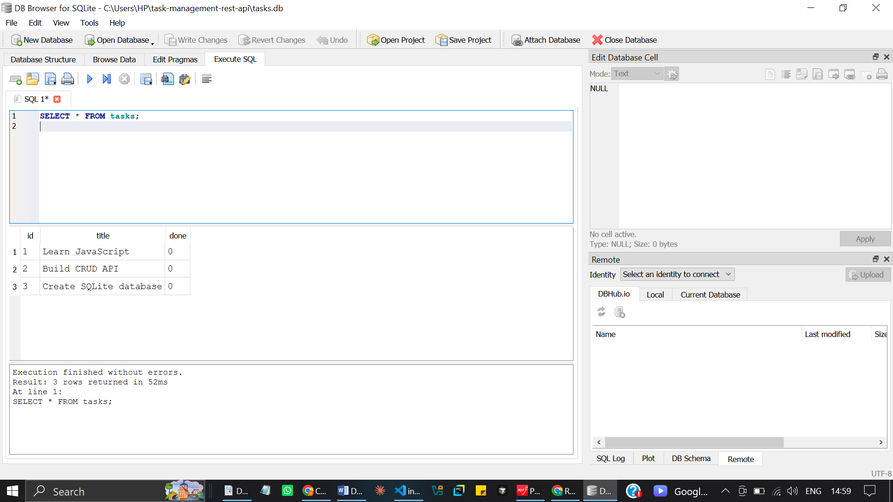

# Task Management REST API

A simple RESTful Task Management API built with **Node.js**, **Express.js**, **SQLite**, and **Swagger UI**.

This project demonstrates the complete **CRUD (Create, Read, Update, Delete)** lifecycle for a REST API. It includes request validation, appropriate HTTP status codes, persistent data storage using SQLite, and interactive API documentation using **OpenAPI (Swagger)**.

---

## Features

* RESTful API built with Express.js
* Create, Read, Update, and Delete (CRUD) tasks
* Persistent task storage using SQLite
* Automatic database and table creation
* Three example tasks seeded automatically on first run
* Input validation for task creation and updates
* Parameterized SQL queries
* Proper HTTP status codes (200, 201, 204, 400, 404)
* Interactive API documentation with Swagger UI
* JSON request and response handling
* Database can be inspected and modified using DB Browser for SQLite

---

## Technologies Used

* Node.js
* Express.js
* SQLite
* better-sqlite3
* Swagger UI Express
* OpenAPI 3.0
* JavaScript
* JSON
* DB Browser for SQLite

---

## Installation

### 1. Clone the repository

```bash
git clone https://github.com/ola-space/task-management-rest-api.git
```

### 2. Navigate into the project folder

```bash
cd task-management-rest-api
```

### 3. Install the project dependencies

```bash
npm install
```

---

## Running the Project

Start the server with:

```bash
node index.js
```

If successful, you should see:

```text
Example app listening on port 3000
```

The SQLite database is created automatically when the application starts. No manual database setup is required.

Open your browser and visit:

* **API:** http://localhost:3000
* **Swagger UI:** http://localhost:3000/docs

---

## Database

This project uses **SQLite** for persistent task storage.

### Why SQLite?

SQLite was chosen because it provides:

* **Single file:** The entire database is stored in one `tasks.db` file.
* **Zero setup:** No separate database server or service is required.
* **Persistence:** Data survives application restarts.
* **Simplicity:** It is lightweight and well suited for a small REST API project.

### Database File

The database file is:

```text
tasks.db
```

It is located in the root directory of the project:

```text
task-management-rest-api/
└── tasks.db
```

The application creates this file automatically if it does not already exist.

When the application starts, it also automatically creates the `tasks` table if it does not exist.

If the table is empty, the application inserts three example tasks:

```text
Learn JavaScript
Build CRUD API
Create SQLite database
```

This means a new user can clone the repository, run `npm install`, start the application with `node index.js`, and immediately use the API without manually creating a database or table.

### Database Persistence

Tasks are stored in SQLite rather than only in the application's memory.

This means that tasks created through the API remain available after the server is stopped and restarted.

The SQLite database is the single source of truth for the task data.

### Git Ignore

The `tasks.db` file is normally kept out of version control using `.gitignore`.

This allows each new clone of the repository to create its own fresh database automatically when the application starts.

---

## API Endpoints

| Method | Endpoint     | Description             |
| :----- | :----------- | :---------------------- |
| GET    | `/`          | Get API information     |
| GET    | `/health`    | Check API health        |
| GET    | `/tasks`     | Get all tasks           |
| GET    | `/tasks/:id` | Get a task by ID        |
| POST   | `/tasks`     | Create a new task       |
| PUT    | `/tasks/:id` | Update an existing task |
| DELETE | `/tasks/:id` | Delete a task           |

---

## Database-Backed CRUD Operations

The API uses SQL queries to perform CRUD operations against the SQLite database.

### Create

New tasks are inserted into the database using a parameterized SQL `INSERT` statement.

```sql
INSERT INTO tasks (title, done)
VALUES (?, ?);
```

### Read

All tasks are retrieved from the database using:

```sql
SELECT * FROM tasks;
```

A specific task can be retrieved using its ID:

```sql
SELECT * FROM tasks WHERE id = ?;
```

### Update

Existing tasks are updated using:

```sql
UPDATE tasks
SET title = ?, done = ?
WHERE id = ?;
```

### Delete

Tasks are removed using:

```sql
DELETE FROM tasks
WHERE id = ?;
```

Parameterized queries are used when values are supplied by API requests.

---

## Example cURL Request

The following command retrieves all tasks from the API.

```bash
curl -i http://localhost:3000/tasks
```

Example response:

```http
HTTP/1.1 200 OK
Content-Type: application/json; charset=utf-8

[
  {
    "id": 1,
    "title": "Learn JavaScript",
    "done": 0
  },
  {
    "id": 2,
    "title": "Build CRUD API",
    "done": 0
  },
  {
    "id": 3,
    "title": "Create SQLite database",
    "done": 0
  }
]
```

---

## Get All Tasks

```bash
curl -i http://localhost:3000/tasks
```

### Example Response

```http
HTTP/1.1 200 OK
Content-Type: application/json; charset=utf-8

[
  {
    "id": 1,
    "title": "Learn JavaScript",
    "done": 0
  },
  {
    "id": 2,
    "title": "Build CRUD API",
    "done": 0
  },
  {
    "id": 3,
    "title": "Create SQLite database",
    "done": 0
  }
]
```

---

## Swagger Documentation

Swagger UI provides interactive API documentation where you can test every endpoint directly from your browser.

Visit:

http://localhost:3000/docs

### Swagger Screenshot


---

## Exploring SQLite with DB Browser

The SQLite database can be opened directly using **DB Browser for SQLite**.

This makes it possible to inspect the `tasks` table, view stored records, and execute SQL queries manually.

### Database Screenshot



---

## Example SQL Query from Stage 4

One of the SQL queries executed manually during the SQLite exploration stage was:

```sql
SELECT * FROM tasks WHERE done = 1;
```

This query retrieves all tasks that have been marked as completed.

Another data-changing query tested during the exploration was:

```sql
UPDATE tasks SET done = 1;
```

This marks all tasks as completed in the database.

Changes made directly to the SQLite database are reflected by the API because both DB Browser and the API use the same `tasks.db` file.

---

## Project Structure

```text
task-management-rest-api/
├── images/
│   ├── swagger.png
│   └── database.png
├── node_modules/
├── index.js
├── openapi.json
├── package.json
├── package-lock.json
├── .gitignore
└── README.md
```

> `tasks.db` is created automatically when the application starts and is normally excluded from Git using `.gitignore`.

---

## Clean Setup

The application does not require a pre-existing database.

To test a clean setup:

1. Remove `tasks.db` if it already exists.
2. Start the application:

```bash
node index.js
```

3. The application automatically:

   * Creates `tasks.db`
   * Creates the `tasks` table
   * Inserts three example tasks
   * Starts the API on port 3000

4. Retrieve the tasks:

```bash
curl -i http://localhost:3000/tasks
```

The API should return the three example tasks.

This means a new user can clone the repository and get a working database-backed API without manually creating or configuring a database.

---

## Repository

GitHub Repository:

https://github.com/ola-space/task-management-rest-api

---

## Author

**Babatunde Olanipekun**

GitHub: https://github.com/ola-space
